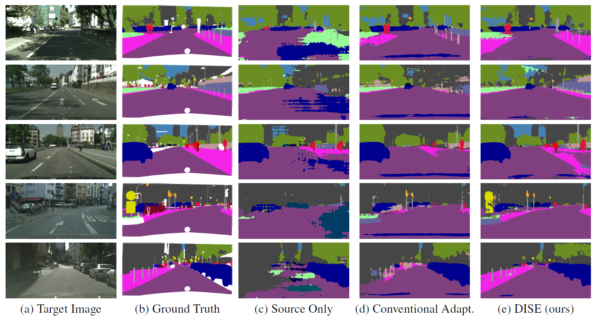
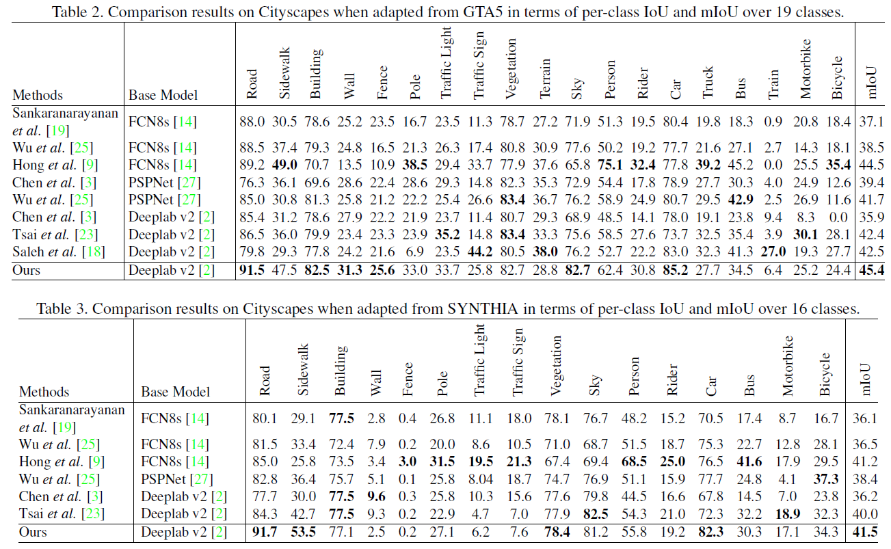

# DISE-Domain-Invariant-Structure-Extraction
Pytorch Implementation of the paper All about Structure: Adapting Structural Information across Domains for Boosting Semantic Segmentation.

Introduction video: (youtube link here)
## Paper
Ciation information here

## Example Results


## Quantitative Results


## Installation
```
git clone https://github.com/a514514772/DISE-Domain-Invariant-Structure-Extraction.git
```
## Datasets

1. Download the [GTA5 Dataset](https://download.visinf.tu-darmstadt.de/data/from_games/) as the source domain and unzip it to  `/data`
2. Download the [Cityscapes Dataset](https://www.cityscapes-dataset.com) as the target domain and unzip it to  `/data`

The structure of `/data` may look like this:
  ```
  ├── data
      ├── Cityscapes
      │   ├── gtFine
      │   └── leftImg8bit
      ├── GTA5
          ├── images
          └── labels
  ```
## Usage
### Example Training Script: GTA5 to Cityscapes
```
python train_dise_gta2city.py --gta5_data_path /data/GTA5 --city_data_path /data/Cityscapes
```
### More options
```
python train_dise_gta2city.py  -h
usage: train_dise_gta2city.py [-h] [--dump_logs DUMP_LOGS] [--log_dir LOG_DIR] [--gen_img_dir GEN_IMG_DIR]
                              [--gta5_data_path GTA5_DATA_PATH] [--city_data_path CITY_DATA_PATH]
                              [--data_list_path_gta5 DATA_LIST_PATH_GTA5]
                              [--data_list_path_city_img DATA_LIST_PATH_CITY_IMG]
                              [--data_list_path_city_lbl DATA_LIST_PATH_CITY_LBL]
                              [--data_list_path_val_img DATA_LIST_PATH_VAL_IMG]
                              [--data_list_path_val_lbl DATA_LIST_PATH_VAL_LBL]
                              [--cuda_device_id CUDA_DEVICE_ID [CUDA_DEVICE_ID ...]]

Domain Invariant Structure Extraction (DISE) for unsupervised domain adaptation for semantic segmentation
```

## Acknowledgement
